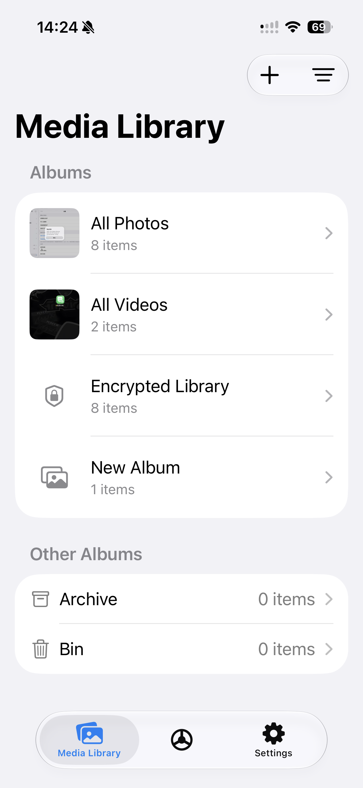
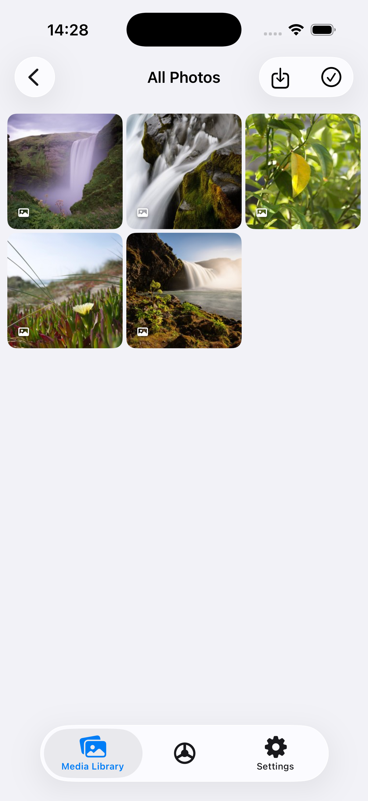
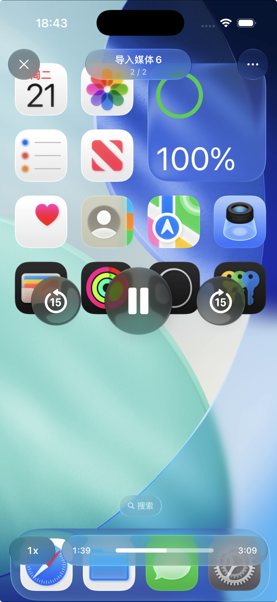
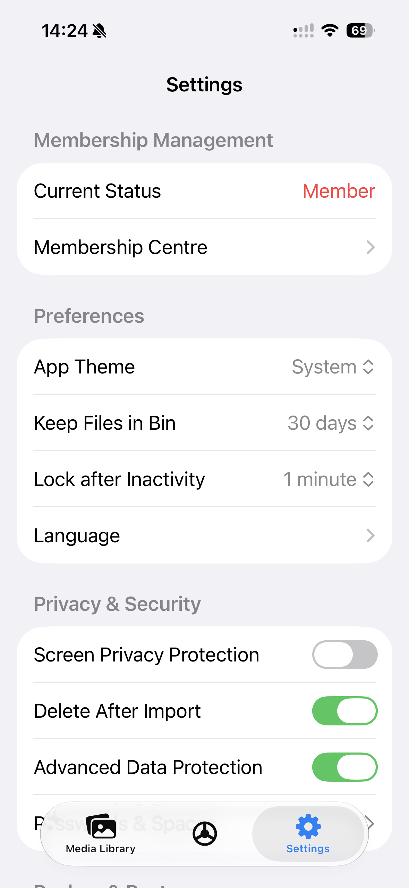
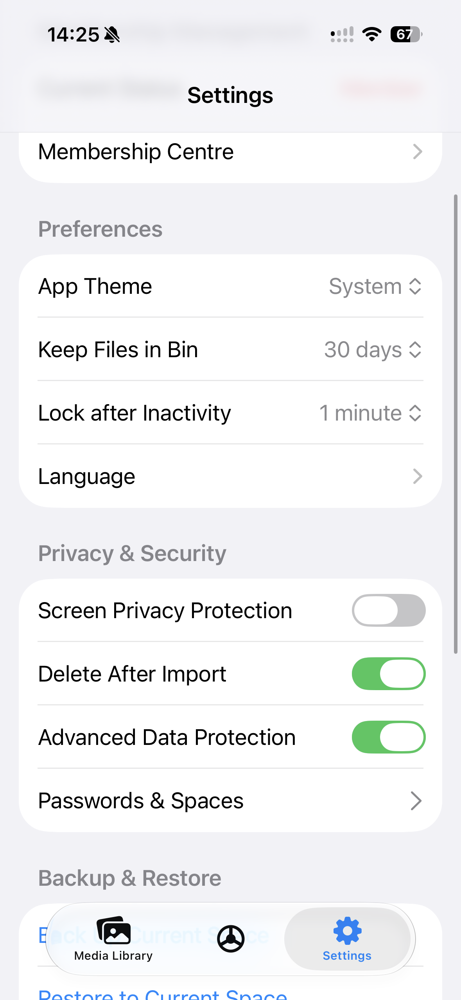
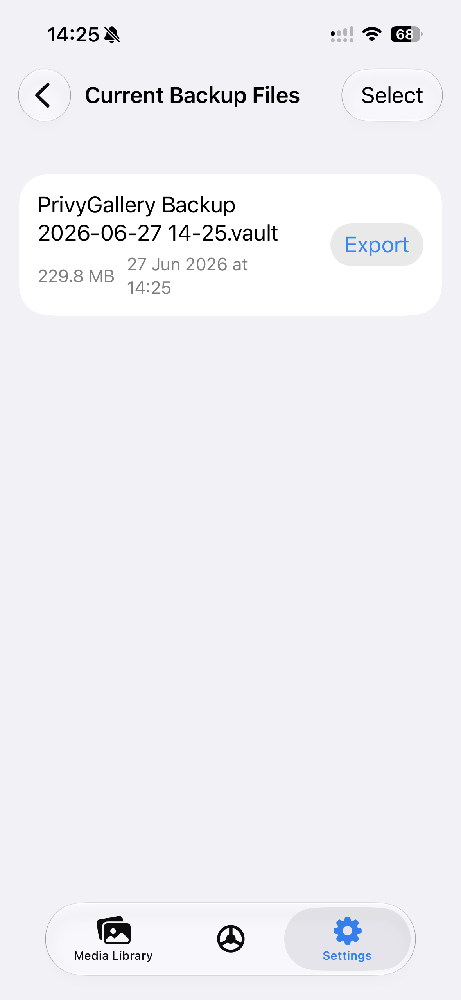

<p align="center">
  
</p>

<h1 align="center">PrivyGallery</h1>

<p align="center">
  <strong>雙空間保險箱</strong> —— 一個本機優先、端到端加密的私密照片與影片之家。
</p>

<p align="center">
  <a href="README.md">English</a> ·
  <a href="README.zh-Hans.md">简体中文</a> ·
  <strong>繁體中文</strong>
</p>

<p align="center">
  <a href="https://apps.apple.com/us/app/privygallery-dual-space-vault/id6765981187">App Store</a> ·
  <a href="Materials/docs/index.html">宣傳頁</a> ·
  <a href="tools/vault-unpacker/">.vault 解包器</a> ·
  <a href="Materials/docs/vault-format.md">備份格式</a> ·
  <a href="SECURITY.md">安全</a> ·
  <a href="PRIVACY.md">隱私</a>
</p>

<p align="center">
  <a href="https://apps.apple.com/us/app/privygallery-dual-space-vault/id6765981187">
    
  </a>
</p>

---

## 概述

PrivyGallery 是一款原生 iOS 私密媒體保險箱。你匯入的照片和影片在儲存之前會先在裝置本機
加密，可以整理進相簿以及兩個完全獨立的空間，並且無需依賴任何後端伺服器即可保持受保護狀態。

一個簡單的理念：**你的私密媒體始終留在你的裝置上、保持加密、由你掌控**——
沒有帳號、不上傳、無分析。

## 螢幕截圖

| 媒體庫 | 相簿 | 媒體播放器 |
| :----: | :--: | :--------: |
|  |  |  |
| **設定** | **設定** | **備份** |
|  |  |  |

## 建構於 Apple 的安全能力之上

PrivyGallery 刻意**不自行實作加密演算法**，而是以標準方式依賴 Apple 提供的安全能力：

| 能力 | Apple API | 在 PrivyGallery 中的作用 |
| --- | --- | --- |
| 對稱式加密 | **CryptoKit** `AES-GCM` | 加密每一張照片/影片以及 `.vault` 備份 |
| 金鑰儲存與包裹 | **鑰匙圈服務** | 儲存每個空間被包裹的資料加密金鑰 |
| 生物辨識解鎖 | **LocalAuthentication** + 鑰匙圈 `biometryCurrentSet` | 以 Face ID / Touch ID 控制對空間金鑰的存取 |
| 硬體級金鑰保護 | **安全隔離區（Secure Enclave）** | 為金鑰的生物辨識保護提供底層支撐 |
| 靜態資料保護 | **資料保護**（`FileProtectionType.complete`） | 為已儲存資料提供作業系統級檔案加密 |
| 金鑰衍生 | `PBKDF2-HMAC-SHA256`（CommonCrypto） | 從你的密碼衍生出備份金鑰 |

由於整體設計依賴經過稽核、廣為理解的系統原語，而非自製密碼演算法，其信任模型更易於推理；
而真正關鍵的部分（`.vault` 格式）則完整公開、可供審查。

## 核心概念

- **兩個獨立空間**——`Space A` 與 `Space B`，各自擁有獨立的密碼、被包裹的金鑰、
  媒體儲存與中繼資料，彼此之間不共享任何狀態。
- **每空間資料加密金鑰（DEK）**——隨機產生，由從你密碼衍生的金鑰包裹。修改密碼只會
  重新包裹 DEK，而**不會**重新加密整個媒體庫。
- **脅迫密碼**——一個特殊密碼可觸發本機緊急抹除。
- **進階資料保護**——強加密媒體使用更嚴格、隔離的預覽路徑。

## 主要功能

- 🔐 儲存前的裝置本機 `AES-GCM` 加密
- 🪟 兩個擁有獨立密碼的獨立空間
- 🔢 4 位、6 位或複雜英數密碼
- 🚨 脅迫密碼 → 緊急抹除
- 👁️ Face ID / 生物辨識解鎖，支援自動鎖定
- 🗂️ 自訂相簿、安全相簿、封存與垃圾桶
- 📥 從「照片」或「檔案」匯入（可選匯入後刪除）
- 📸 針對截圖 / 錄影情境的螢幕隱私行為
- 💾 可攜帶、加密的 `.vault` 備份

## `.vault` 備份格式

PrivyGallery 可以把整個空間匯出為單一加密的 `.vault` 檔案。該格式**公開且具文件**——
目標是透明與避免鎖定，而**不是**隱藏設計。

概覽（完整規範見 [`Materials/docs/vault-format.md`](Materials/docs/vault-format.md)）：

1. 一段明文 JSON 標頭（`SVEX`，v2），宣告 KDF、鹽、加密演算法、分塊大小以及多分卷資訊。
2. 主體是一個內部封存檔（`SVAR`），被切分為多個區塊，每塊以 `AES-GCM` 獨立封裝
   （每塊都對格式版本、分卷序號、區塊序號與封存長度進行驗證）。
3. 內部封存檔包含一份 JSON 清單（相簿 + 媒體中繼資料），隨後是各個媒體資料區塊，
   以 LZFSE 或原始（raw）方式壓縮儲存。

金鑰衍生使用 `PBKDF2-HMAC-SHA256`；每空間的 App 金鑰絕不會寫入備份——備份是用從
**匯出密碼**衍生的金鑰加密的。

## Go 撰寫的 `.vault` 解包器

本倉庫附帶一個獨立、跨平台的還原工具：
**[`tools/vault-unpacker`](tools/vault-unpacker/)**。

### 用途

- 在 **macOS、Linux 或 Windows** 上從 `.vault` 備份中解密並**擷取你的原始照片和影片**——
  無需 App，因此你永遠不會被鎖定。
- 檢視備份內容（`-l` 僅列出項目而不擷取）。
- 只要你擁有檔案和匯出密碼，即使 iOS App 無法使用也能還原資料。

```bash
cd tools/vault-unpacker
go build -o vault-unpacker .
./vault-unpacker -o ./restored "PrivyGallery Backup.vault"
```

### 它**不做**什麼（限制）

- 它是一個**還原 / 擷取**工具，而非完整的重新匯入器。它會把明文媒體檔案寫到一個資料夾，
  但**不會**把它們重新載入 iOS App、不會在 App 內重建相簿，也不會還原 App 狀態。
- 它**需要正確的匯出密碼**。密碼一旦遺失便無法還原——加密是真實有效的。
- 建構時需要 **C 編譯器**，因為 LZFSE 解壓縮透過 cgo 使用 Apple 的參考實作
  （以保證解壓縮結果逐位元組一致）。
- 相簿 / 中繼資料關係保存在清單中，但僅以檔名 + 一個 `_Trash/` 資料夾的形式呈現，
  並不會重建為 App 物件。

完整用法見 [`tools/vault-unpacker/README.md`](tools/vault-unpacker/README.md)。

## 從原始碼建構

需求：Xcode 26+、iOS 部署目標 `17.0`、SwiftUI。

```bash
# 標準建構（請在 Xcode 中設定你自己的簽署團隊）
xcodebuild -scheme SecurityFolder -destination 'generic/platform=iOS' build

# 無簽署本機驗證
xcodebuild -scheme SecurityFolder -destination 'generic/platform=iOS' \
  -derivedDataPath /private/tmp/SecurityFolderDerivedData \
  CODE_SIGNING_ALLOWED=NO build
```

> 專案中的 `DEVELOPMENT_TEAM` 預設留空；在建構到實機之前，請設定你自己的
> Apple Developer 團隊與 Bundle Identifier。

## 專案結構

```text
SecurityFolder/
├── SecurityFolder/          # 主 iOS App 目標（App、Core、Features、Shared）
├── Share/                   # 共享擴充功能目標
├── tools/
│   └── vault-unpacker/      # 跨平台 Go .vault 還原 CLI
├── Materials/
│   ├── docs/                # 文件 + 宣傳頁（index.html）
│   └── images/              # 螢幕截圖
├── LICENSE  · SECURITY.md · PRIVACY.md
└── SecurityFolder.xcodeproj
```

## 在地化

已在地化為簡體中文、英文、繁體中文變體、日文與韓文。

## 限制

- iOS 沒有完全受支援的公開 API 可以全域禁止截圖；部分強化依賴平台行為，
  應在不同 iOS 版本上進行測試。
- 大相簿與大批量匯入需要持續的記憶體壓力調校。
- 本倉庫以 App 為先，尚未封裝為可重用的 SDK。
- **尚未進行正式的第三方安全性稽核。** 見 [SECURITY.md](SECURITY.md)。

## 授權

採用 **Apache License 2.0** 授權——見 [LICENSE](LICENSE)。

---

<p align="center">
  為重視隱私的人用心打造。 ·
  <a href="https://apps.apple.com/us/app/privygallery-dual-space-vault/id6765981187">在 App Store 下載</a>
</p>
